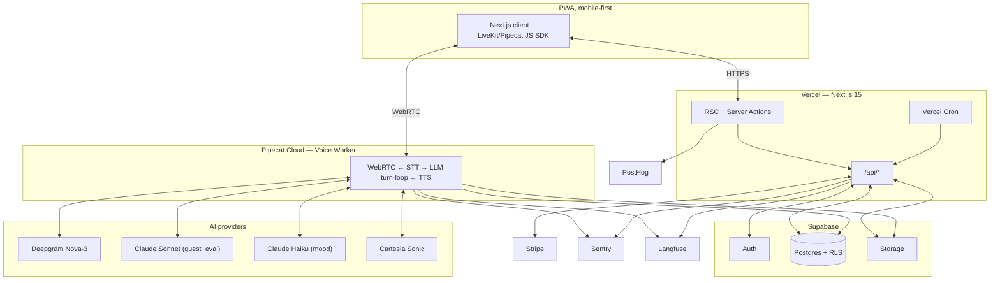
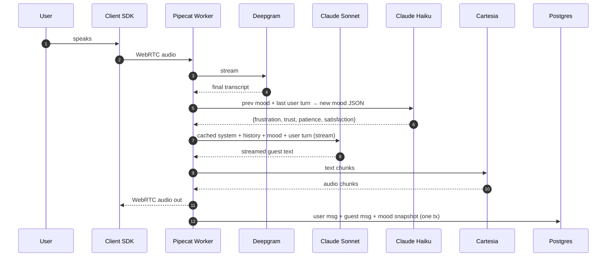
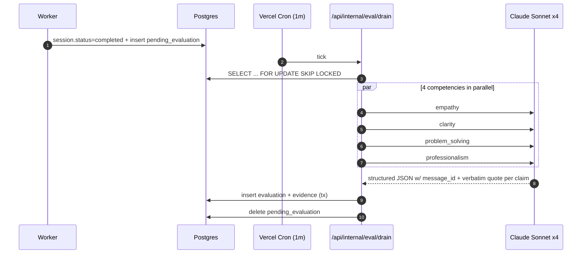
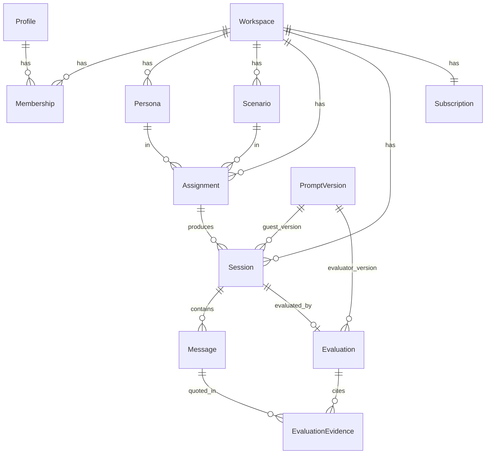

# Lobbyee — Production Architecture

> Voice-based AI training simulator for hospitality front-line staff. B2B SaaS, multi-tenant, voice-first with text fallback. This is the source of truth for the build.

---

## 1. TL;DR / System Overview

A workspace owner (hotel/restaurant GM) creates AI guest personas + scenarios, assigns them to staff, and the staff member holds a real-time **spoken conversation** in a browser. The guest has a personality, a mood that evolves turn-by-turn, and hidden success criteria. On session end, a separate evaluator LLM scores the transcript across four competencies (empathy, clarity, problem-solving, professionalism), grounding every claim in a verbatim quote. The manager sees per-staff trends on a dashboard.

**The one decision driving everything else.** Voice forces a topology split. Next.js on Vercel runs UI, auth, persistence, and the evaluator. A **separate long-running worker** — Pipecat on Pipecat Cloud — runs the WebRTC media pipeline and per-turn LLM loop. Vercel serverless cannot hold persistent media sockets, and this is the *one* extra service the architecture justifies.



**Biggest single risk.** iOS Safari PWA audio: `getUserMedia` under installed-PWA WebKit has documented regressions, audio must unlock inside the tap gesture, lock-screen suspends capture. We do *not* hand-roll WebRTC — we ride LiveKit/Pipecat client SDKs, test on physical iPhones in installed-PWA mode from Phase 5 day one, and ship the text fallback as a first-class entry point so a busted iOS session is recoverable in one tap.

---

## 2. Topology & Components

| Service | Role | Why this |
|---|---|---|
| Next.js 15 / Vercel | UI, RSC, Server Actions, Stripe webhooks, eval orchestration | Boring stack the founder ships in daily; RSC = fast manager dashboard. |
| Supabase Postgres | Tenant data, transcripts, evaluations | RLS is the multi-tenancy primitive. |
| Supabase Auth | Identity, JWT | `auth.uid()` inside Postgres makes RLS clean. |
| Supabase Storage | Session audio bundles | Same auth+RLS model; signed URLs. |
| **Pipecat Cloud** | Long-running WebRTC + per-turn LLM loop | Vercel cannot. Pipecat Cloud is right for a solo founder: managed scale-to-zero, no K8s, pipeline graph in plain Python. LiveKit Agents on LiveKit Cloud is the runner-up — pick if multi-participant is ever needed. |
| Deepgram Nova-3 | Streaming STT | Cheapest at sub-300ms TTFP in 2026. |
| Cartesia Sonic | Streaming TTS | ~40ms TTFB beats ElevenLabs Flash; ElevenLabs kept as voice-fallback behind a flag. |
| Anthropic Claude | Guest (Sonnet), evaluator (Sonnet), mood updater (Haiku) | Prompt caching on persona system block cuts ~70% input cost across a session. One vendor → one set of keys, billing, eval baselines. |
| Stripe | Per-workspace flat plan + session cap | Default. |
| Sentry / PostHog / Langfuse | Errors / product funnels / LLM tracing+eval datasets | Langfuse is load-bearing — the evaluator is the product moat. |

### 2a. One voice turn



The guest message stored in `Message` is the **verbatim text we sent to TTS** — not a re-transcription. That is what makes the evaluator's quote-grounding sound. The user message is the final Deepgram transcript.

### 2b. Post-session evaluation



---

## 3. Auth & Multi-Tenancy

### 3a. Model

```
auth.users (Supabase)
  └── profile (1:1, mirror)
       └── membership (M:N → workspace, role ∈ {owner,manager,staff})
             └── workspace
```

A Supabase trigger creates `profile` on `auth.users` insert. Manager signup creates a workspace. Staff get `membership(status=pending)` rows + a magic-link invite; click flips status to `active`. Same `auth.uid()` can hold memberships in multiple workspaces (regional trainer).

### 3b. RLS as source of truth

Every tenant-scoped table carries `workspace_id` and has `FORCE ROW LEVEL SECURITY` (so even the owner role obeys policies). Policies key off `auth.uid()`:

```sql
create or replace function app.current_workspace_ids() returns uuid[]
language sql stable security definer as $$
  select coalesce(array_agg(workspace_id), '{}')
  from membership where user_id = auth.uid() and status = 'active'
$$;

create policy session_tenant_read on session for select
  using (workspace_id = any(app.current_workspace_ids()));
```

Manager/staff scoping layers on top: staff see only their own sessions; managers see all in their workspace.

### 3c. The Prisma + RLS plumbing

Prisma uses a privileged role and **bypasses RLS** by default. So:

**Two clients, never blurred.**

```ts
export const dbAdmin = new PrismaClient(); // migrations, Stripe webhooks, cron, admin
export async function dbForRequest(userId: string) { /* per-tx RLS-scoped */ }
```

**Every tenant query** runs through `dbForRequest`, which opens a transaction and runs `select set_config('request.jwt.claims', $1, TRUE)` (TRUE = LOCAL, dies at COMMIT) so RLS policies read `auth.uid()`. All queries run inside that transaction. We use **Yates (`cerebruminc/yates` v4)** as the wrapper — it implements this correctly and survives `prisma generate`. Prisma's own RLS example is explicitly labeled non-production; rolling our own is exactly the kind of unread code a solo vibe-coder should avoid.

**The Supavisor footgun.** Vercel + Supabase = Supavisor transaction-pooling (port 6543, `?pgbouncer=true`, prepared statements off). In transaction mode, **a bare `SET` leaks across requests** — request A could see request B's tenant. Only `SET LOCAL`/`set_config(...,TRUE)` inside BEGIN/COMMIT is safe. Migrations use `DIRECT_URL` (5432).

**Policy versioning.** Tables via Prisma, policies appended as raw SQL **inside the same migration file** (`prisma migrate dev --create-only` then hand-edit). Supabase migration folder is reserved for purely-Supabase resources (auth triggers, storage policies). A pre-merge lint check fails if the two folders touch each other's tables.

**The CI tenant-isolation test (load-bearing gate).** RLS failures are **silent on SELECT/UPDATE/DELETE** (return empty; only INSERT throws). So the test seeds workspaces A and B, opens a scoped client as a user in A, and asserts the count of *every* tenant table = 0 when querying with no `workspaceId` predicate. Hard merge gate.

**Defense in depth.** A Prisma `$extends` middleware injects `where: { workspaceId }` into all tenant model queries from `dbForRequest`. RLS is the source of truth, but Postgres CVEs happen.

---

## 4. Data Model

### 4a. Core Prisma sketch

```prisma
model Workspace {
  id            String   @id @default(uuid()) @db.Uuid
  slug          String   @unique
  plan          Plan     @default(trial)
  sessionCapMonthly Int  @default(50)
  stripeCustomerId  String?
  memberships   Membership[]
  personas      Persona[]; scenarios Scenario[]; sessions Session[]
}

model Profile { // mirrors auth.users via trigger
  id String @id @db.Uuid
  email String
  memberships Membership[]
}

model Membership {
  id String @id @default(uuid()) @db.Uuid
  workspaceId String @db.Uuid
  userId String @db.Uuid
  role Role        // owner | manager | staff
  status MemberStatus  // pending | active | removed
  @@unique([workspaceId, userId]); @@index([userId])
}

model Persona { // the "who" — reusable
  id String @id @default(uuid()) @db.Uuid
  workspaceId String @db.Uuid
  name String; backstory String; voiceId String
  baselineMood Json
}

model Scenario { // the "what" — reusable; library scenarios have workspaceId=null
  id String @id @default(uuid()) @db.Uuid
  workspaceId String? @db.Uuid
  title String; situation String
  successCriteria Json
  difficulty Int
  isLibrary Boolean @default(false)
}

model Assignment {
  id String @id @default(uuid()) @db.Uuid
  workspaceId String @db.Uuid
  personaId String @db.Uuid; scenarioId String @db.Uuid
  assignedTo String @db.Uuid; assignedBy String @db.Uuid
  dueAt DateTime?
  @@index([workspaceId, assignedTo])
}

model Session {
  id String @id @default(uuid()) @db.Uuid
  workspaceId String @db.Uuid
  assignmentId String? @db.Uuid
  personaId String @db.Uuid; scenarioId String @db.Uuid
  userId String @db.Uuid
  promptVersionId String @db.Uuid
  status SessionStatus  // pending|in_progress|completed|abandoned|errored
  modality Modality     // voice | text
  startedAt DateTime?; endedAt DateTime?
  finalMood Json?
  audioBundleUrl String?
  messages Message[]; evaluation Evaluation?
  @@index([workspaceId, userId, startedAt])
  @@index([workspaceId, status])
}

model Message {
  id BigInt @id @default(autoincrement())
  sessionId String @db.Uuid
  workspaceId String @db.Uuid   // denormalized for RLS perf
  turnIndex Int
  role TurnRole              // user | guest | system
  text String
  audioUrl String?
  moodSnapshot Json?         // mood AFTER this turn
  startedAt DateTime; endedAt DateTime
  @@unique([sessionId, turnIndex])
}

model Evaluation {
  id String @id @default(uuid()) @db.Uuid
  sessionId String @unique @db.Uuid
  workspaceId String @db.Uuid
  evaluatorPromptVersionId String @db.Uuid
  empathyScore Int; empathySummary String
  clarityScore Int; claritySummary String
  problemSolvingScore Int; problemSolvingSummary String
  professionalismScore Int; professionalismSummary String
  overallSummary String
  evidence EvaluationEvidence[]
}

model EvaluationEvidence {
  id BigInt @id @default(autoincrement())
  evaluationId String @db.Uuid
  workspaceId String @db.Uuid
  competency Competency       // empathy|clarity|problem_solving|professionalism
  kind EvidenceKind            // strength | missed_opportunity
  messageId BigInt             // FK to Message.id
  quote String                 // verbatim slice of message.text
  rationale String
}

model PromptVersion {
  id String @id @default(uuid()) @db.Uuid
  kind PromptKind   // guest_system | mood_update | evaluator
  version String    // "guest-system@2026.06.07-a"
  template String; schemaJson Json?
  isActive Boolean @default(false)
  @@unique([kind, version])
}

model PendingEvaluation {
  sessionId String @id @db.Uuid
  workspaceId String @db.Uuid
  attempts Int @default(0)
  lastError String?
  nextAttemptAt DateTime @default(now())
  @@index([nextAttemptAt])
}

model Subscription {
  workspaceId String @id @db.Uuid
  stripeSubscriptionId String @unique
  stripeStatus String
  currentPeriodEnd DateTime
  sessionsUsedThisPeriod Int @default(0)
}
```

### 4b. Tenant scoping

Tenant-scoped (RLS on + force on): Membership, Persona, Scenario (when non-library), Assignment, Session, Message, Evaluation, EvaluationEvidence, PendingEvaluation, Subscription. Global: PromptVersion; library Scenarios get a carve-out (`workspaceId IS NULL → readable by all`).

### 4c. Indexing notes

- Manager dashboard: `(workspaceId, startedAt desc)` on Session.
- Staff "my sessions": `(workspaceId, userId, startedAt desc)` (in schema).
- Eval drain: `PendingEvaluation(nextAttemptAt)`.
- Transcript load: `Message(sessionId, turnIndex)` covered by unique.
- Rolling competency averages: add `Evaluation(workspaceId, createdAt)`.

### 4d. Audio storage

Transcript is the source of truth for evaluation; audio is optional. One bundled `.ogg` per session at `sessions/{workspaceId}/{sessionId}.ogg` in a private bucket, Storage RLS mirrors Session policy, signed URLs 5-min TTL. **Hard delete after 90 days** via daily cron. Per-turn audio is **not** persisted in v1 (cost + privacy) — a deliberate trade-off.

### 4e. ER diagram



---

## 5. The Conversation Engine

### 5a. Persona vs Scenario

- **Persona** = the guest's identity: name, backstory, voice, baseline mood. Reusable.
- **Scenario** = the situation + structured success criteria + difficulty. Reusable.
- A **session** = `(persona, scenario, staff_user, promptVersion)`.

5 personas × 20 scenarios = 100 unique sessions, not 100 hand-authored prompts.

### 5b. One voice turn, end to end

Worker holds an in-memory state:

```ts
type ConversationState = {
  sessionId: string; workspaceId: string;
  persona: PersonaSnapshot; scenario: ScenarioSnapshot;
  promptVersion: PromptVersionSnapshot;
  mood: { frustration: number; trust: number; patience: number; satisfaction: number };
  history: Array<{ role: 'user'|'guest'; text: string; tIndex: number }>;
  guestSystemPrompt: string; // rendered ONCE at session start
};
```

1. **Capture.** LiveKit/Pipecat SDK opens WebRTC; worker subscribes to inbound audio.
2. **STT.** Stream into Deepgram; final transcript on end-of-utterance = the user turn.
3. **Mood update.** Single Haiku call: `{prev_mood, user_turn, last_guest_turn}` → JSON-schema tool use → new mood vector. Cap 300ms p50; on timeout reuse `prev_mood`.
4. **Context assembly.** Render guest system prompt **once per session**. Compose `messages = [{role:system, content: guestSystemPrompt, cache_control: ephemeral}, ...history, {role:user, content: <mood-injection> + user_turn}]`. The mood injection is a short paragraph prepended into the **user** message, **not** the system — keeping the system byte-identical across turns is what makes Anthropic prompt caching hit.
5. **Guest LLM stream.** Sonnet, streamed. Output fans out two ways: (a) into Cartesia for TTS at sentence boundaries; (b) into a buffer that becomes the persisted `Message.text`.
6. **TTS streaming.** Cartesia returns chunks; worker forwards over WebRTC.
7. **Persist.** After guest finishes, write user `Message` + guest `Message` + `Session.finalMood` in one transaction.

**Why mood-update is its own call.** (a) Determinism for the evaluator — the mood the guest model *saw* matches the stored one. (b) Cost — Haiku is ~1/20th of Sonnet, 90% of transitions are mechanical. (c) The structured output makes mood-over-time a one-query chart on the session replay page — a "wow" demo.

### 5c. Prompt versioning matters

Every `Session` and `Evaluation` row records its `promptVersionId`. When the guest template changes, we mint a new `PromptVersion`, flip `isActive`, old sessions retain lineage. This is what lets us regression-test prompts (§6e) and what the founder defends in an interview: *every LLM artifact in production is reproducible to the exact template that produced it.*

### 5d. Context window

Sessions are 3–8 min, 15–40 turns. v1 limit: if `history.length > 60`, Haiku summarizes the oldest 40 turns into a single `system` note in the in-memory history. All turns persist to DB; the evaluator always reads from DB, not worker memory.

### 5e. Prompt caching

Anthropic prompt caching applied to the system block (~1.5–3k tokens) gets a 5-min cache, refreshed each turn. Cuts input cost ~70% across a session and shaves ~100–200ms off TTFT.

### 5f. Text fallback

The text mode swaps the audio leg only: chat UI, the same worker on the same host but a different pipeline graph receiving `user.text` over WebSocket, streaming `guest.text` back. No Deepgram, no Cartesia. ~$0.02/session vs ~$0.30. **Ships day one** — it's the bypass for every iOS audio bug and every flaky-wifi train commute.

### 5g. Live coach hints (always-on — decided 2026-06-11)

A persistent one-line `COACH` strip on the live session screen updates every turn with a concrete nudge ("She's still tense — acknowledge before you explain"). Product decision: always-on (founder call, accepting the immersion trade-off); a per-workspace "hints off" toggle is the future lever if pilot data shows hint-dependence.

**Mechanics.** One additional **Haiku** call per turn: input = `{new_mood, last_guest_turn, scenario.successCriteria, last_hint}`; output = structured `{hint: string}` capped at ~12 words. It runs **concurrently with TTS streaming** of the guest reply (the hint is about how to handle what the guest is saying, so it naturally lands while the guest talks) — zero added turn latency. Delivered to the client over the existing data channel as a `coach.hint` event.

**Persistence.** Each hint is stored as a `Message` row with `role: coach` (add `coach` to the `TurnRole` enum), excluded from the guest LLM's conversation history and from the transcript shown to the guest model — the guest must never "hear" the coach. The evaluator MAY read coach turns (v2: "coach suggested X at turn 5; trainee did/didn't") but v1 evaluation ignores them to keep the gold-set rubric clean.

**Prompt versioning.** The hint prompt is a `PromptVersion` of kind `coach_hint`, same lineage rules as the rest (§5c).

**Cost.** ~25 Haiku hint calls/session ≈ +$0.01–0.02 — inside the §7a rounding; per-session total stays ~$0.47–0.49.

**Failure mode.** Hint call times out (>800ms) or errors → strip silently keeps the previous hint; never block or delay the guest reply for a hint. The coach is decoration on the loop, not part of it.

---

## 6. The Evaluation Engine (the differentiator)

This is what turns Lobbyee from a voice toy into a coaching product.

### 6a. Trigger

When the worker sees `session.status → completed` (user hangs up, or 90s silence timeout), it inserts a `PendingEvaluation(sessionId)` in the same transaction that closes the session. Idempotent: `INSERT ... ON CONFLICT DO NOTHING`.

### 6b. Job runner — recommendation

**Vercel Cron + a `pending_evaluations` queue table.** For a solo founder:
- One fewer vendor to monitor.
- The job is batchable and slow (10–30s is fine).
- `FOR UPDATE SKIP LOCKED` on Postgres is a textbook pattern that interviews well: *"I used Postgres as a queue because the work was low-throughput and idempotent; Inngest/Trigger.dev would have been over-engineering."*

Cron tick (1 min) hits `/api/internal/eval/drain` (Bearer `${CRON_SECRET}`):

```sql
BEGIN;
SELECT session_id FROM pending_evaluation
  WHERE next_attempt_at <= now() AND attempts < 5
  ORDER BY next_attempt_at LIMIT 5 FOR UPDATE SKIP LOCKED;
-- process, COMMIT per session
```

At >5k sessions/day, swap in Inngest — nothing else changes.

### 6c. The evaluator itself

**One structured-output Sonnet call per competency, four in parallel.** Why per-competency:
- Each gets a focused rubric → empirically better gold-set scores.
- 4x faster wall-clock.
- A competency can be re-versioned independently.

Schema (zod, also the runtime validator):

```ts
const EvalSchema = z.object({
  competency: z.enum(['empathy','clarity','problem_solving','professionalism']),
  score: z.number().int().min(1).max(5),
  summary: z.string().min(40).max(400),
  evidence: z.array(z.object({
    kind: z.enum(['strength','missed_opportunity']),
    messageId: z.number().int(),    // MUST be a real Message.id from the transcript
    quote: z.string().min(1),       // MUST be verbatim substring of that message
    rationale: z.string().min(20).max(300),
  })).min(0).max(6),
});
```

**The grounding rule.** Prompt: *"If you cannot quote a specific message verbatim to support a claim, leave evidence empty. Hallucinated quotes will be rejected."* Server-side validator confirms each `quote` is a (case-insensitive, whitespace-normalized) substring of `Message.text`. On fail, evidence is discarded and the call retried once with a corrective system message. After two failures, persist `summary` only, flag in Langfuse. This validator is ~30 lines and worth more than any prompt tweak.

### 6d. Persistence, idempotency, retries

The four results write in one transaction: `Evaluation` (1) + `EvaluationEvidence` (0–24). `Evaluation.sessionId` is unique → re-runs are no-ops. On failure, txn rolls back, `attempts++`, `next_attempt_at = now() + exp_backoff(attempts)`. After 5, row → `eval_dead_letter` + Sentry alert.

### 6e. The eval-of-the-eval (the resume bullet)

A **gold set of 30–50 human-rated transcripts** lives as a Langfuse Dataset: `{ transcript, human_scores, gold_strengths, gold_missed }`. Authored by founder + 1 hospitality SME, refreshed quarterly.

**Two metrics, tracked on every evaluator prompt change:**
1. **Score agreement.** MAE of model vs human, per competency. Target: ≤0.6 on a 1–5 scale.
2. **Evidence overlap.** Fraction of human moments the model surfaces (recall) and fraction of model evidence the human agrees with (precision). Target: F1 ≥ 0.55 at v1.

**CI gate.** Any PR touching `prompts/evaluator/*` or eval client runs the gold-set regression in Langfuse. MAE worsens by >0.2 or F1 drops >0.1 vs the active prompt → PR blocked. Nightly scheduled run catches model drift.

This subsystem is the answer to *"tell me about a project where you thought about LLM reliability."*

### 6f. Aggregation → dashboard

Manager dashboard reads small denormalized views (refreshed on demand, not materialized in v1):
- `staff_rolling_competency` — last 30d per-staff mean per competency.
- `staff_trend` — w/w delta per competency.
- `workspace_top_missed` — most common missed-opportunity rationale (semantic clustering = v2; v1 = top quoted phrases).

---

## 7. Cost & Scaling Guardrails

### 7a. Per-session economics (~6-min voice)

| Line | Cost |
|---|---|
| Deepgram Nova-3 STT | ~$0.046 |
| Sonnet guest (cached system, ~25 turns) | ~$0.12 |
| Haiku mood (~25) | ~$0.01 |
| Cartesia TTS | ~$0.08 |
| Pipecat worker (6 min × $0.025/min) | ~$0.15 |
| Sonnet evaluator (4 competencies) | ~$0.06 |
| **Total** | **~$0.47** |

Text: ~$0.10. Session cap of 50/mo on a $79 starter plan → COGS <30%.

### 7b. The cap, enforced in code

`Session.create` Server Action runs an atomic `UPDATE subscription SET sessions_used_this_period = sessions_used_this_period + 1 WHERE workspace_id = $1 AND sessions_used_this_period < $cap RETURNING ...` — no race. Reset on Stripe `invoice.paid`. The worker never gets a session token until Vercel checks the cap.

### 7c. Model routing

Haiku: mood updater, history summarization. Sonnet: guest, evaluator. Cached: every system block. The evaluator does not need a frontier model — the verbatim validator catches what cheaper models would otherwise leak.

### 7d. Scaling to ~50 workspaces

50 × 50/mo = 2,500 sessions/mo. Pipecat Cloud, Supavisor, and Vercel Cron all handle this trivially. **No architectural change required to first revenue.** The re-architecture line is ~500 sessions/day: move evaluator off Vercel Cron to Inngest.

---

## 8. Repo Structure

**One repo, no workspace split.** Voice worker at `worker/` because (a) shared types must not drift, (b) the founder can't keep two repos green, (c) deploy split is handled by CI workflows.

```
lobbyee/
├── app/                              # Next.js 15 App Router
│   ├── (marketing)/  (auth)/
│   ├── (workspace)/[slug]/
│   │   ├── train/sessions/[id]/      # staff: live + replay
│   │   └── manage/{personas,scenarios,assignments,team,dashboard}/
│   └── api/
│       ├── stripe/webhook/
│       ├── voice/session-token/      # short-lived worker token
│       └── internal/eval/drain/      # CRON_SECRET protected
├── features/                         # ui + actions + zod, per domain
│   └── {personas,scenarios,sessions,evaluations,billing,workspace}/
├── lib/
│   ├── db/         # dbAdmin, dbForRequest (Yates), $extends middleware
│   ├── auth/       # supabase helpers, getCurrentMembership()
│   ├── ai/         # claude clients, schemas, prompt rendering
│   ├── voice/      # session-token issuance, worker handoff types
│   ├── billing/    # stripe
│   ├── obs/        # sentry, posthog, langfuse
│   └── env.ts      # zod-validated process.env
├── prompts/                          # ALL prompts here, versioned
│   ├── guest_system/{2026.06.07-a.md, index.ts}
│   ├── mood_update/
│   └── evaluator/{empathy,clarity,problem_solving,professionalism}.md
├── prisma/{schema.prisma, migrations/}
├── supabase/migrations/              # auth triggers + storage policies ONLY
├── worker/                           # Pipecat voice worker (Python)
│   ├── pyproject.toml
│   ├── pipeline.py mood.py persistence.py
│   └── Dockerfile
├── tests/
│   ├── unit/  integration/  e2e/
│   ├── integration/tenant-isolation.test.ts  # HARD GATE
│   └── eval/gold-set.test.ts                  # Langfuse dataset
└── .github/workflows/{ci.yml, eval-nightly.yml, deploy-worker.yml}
```

`worker/` is Python (Pipecat is Python-native) — the only non-TS surface. Shared wire types live in `lib/voice/wire-types.json` imported both sides.

---

## 9. Production Code Standards

**TypeScript.** Strict, `noUncheckedIndexedAccess`, `exactOptionalPropertyTypes`. No `any` (lint-enforced).

**Lint/format.** Biome. (Brief because boring.)

### 9a. Testing strategy

| Layer | Tool | Content | When |
|---|---|---|---|
| Unit | Vitest | Prompt rendering, mood JSON parsing, evidence validator, zod schemas | Every push |
| Integration | Vitest + Supabase local | RLS policies, server actions hitting real Postgres, Stripe webhooks with stub Stripe | Every push |
| **Tenant isolation** | Vitest | Seed workspaces A and B, run every model query as user A, assert 0 rows of B; INSERTs of B by A must throw | **Hard merge gate** |
| E2E | Playwright | Critical paths only: (1) invite→accept→see assignment, (2) text session→eval→manager sees it, (3) billing checkout | Pre-merge + nightly |
| Voice smoke | Playwright + `--use-fake-device-for-media-stream` | One end-to-end voice session round-trips | Nightly (flaky by nature) |
| Eval regression | Vitest + Langfuse Dataset API | Gold-set MAE + F1 thresholds | On any `prompts/evaluator/*` or `lib/ai/eval/*` change; nightly against active prompt |

**Error handling.** Server actions return `Result<T, AppError>` (no thrown exceptions across the RSC boundary). Sentry captures both sides; every breadcrumb tagged with `workspaceId`.

**Zod at every boundary.** Server-action inputs, API bodies, LLM structured outputs, env vars. The evaluator's zod schema is the *same schema* in validator and runtime type — single source.

**Structured logging.** `pino` JSON. Every log line carries `workspaceId` and `sessionId`.

**Secrets.** Vercel env vars for prod/preview; `.env.local` for dev; Pipecat Cloud secrets for worker. `lib/env.ts` zod-validates at boot — missing env crashes the process immediately, not at first use.

### 9b. Vibe-coding safety net

The founder won't read the diff. The org-chart `code-reviewer` + `security-auditor` + `qa-tester` agents fired by `/safety-check` before any merge are non-negotiable. Two Lobbyee-specific additions:

1. `/safety-check` must verify *"every new query in `features/*/server` uses `dbForRequest`, not `dbAdmin`"* — the single most likely silent multi-tenant footgun.
2. Any PR touching `prompts/evaluator/*` triggers the eval-regression suite AND requires `/safety-check` to surface the agreement-metric delta in plain language so the founder sees it.

---

## 10. CI/CD & Environments

| Env | DB | Worker |
|---|---|---|
| Local | Supabase local stack (`supabase start`) | Pipecat run locally via `python pipeline.py` |
| Preview | Supabase branch per PR (auto via integration) | Shared `worker-preview` deployment, per-session env-injected DB URL |
| Prod | Supabase prod | Pipecat Cloud prod |

Supabase branching is the magic that lets RLS migrations run safely against ephemeral DBs per PR.

**`ci.yml`:** typecheck → biome → unit → integration (incl. tenant-isolation HARD GATE) → next build → Playwright (against preview URL) → eval-regression (only if `prompts/**` or `lib/ai/eval/**` changed).

**`eval-nightly.yml`:** nightly gold-set run against the active prompt → Sentry on regression.

**`deploy-worker.yml`:** on push to `main` touching `worker/**`, build Docker image, push to Pipecat Cloud. Worker version is pinned in `lib/voice/worker-version.ts` so the Next.js side knows which contract to expect.

**DB migrations in CI.** `prisma migrate deploy` against the env's `DIRECT_URL` (5432, unpooled). Migration `.sql` files carry their RLS-policy CREATEs in-line — runs in one transaction. A pre-merge `scripts/check-migration-domains.ts` fails if a Supabase migration touches a Prisma-owned table or vice versa, so they never fight.

---

## 11. Security & Privacy

- **Tenant isolation.** RLS as §3; CI gate as §9.
- **PII in transcripts.** Staff performance = sensitive employment data. Mitigations: workspace-RLS scope on all transcript views; workspace setting defaults to managers see evidence-only (not full transcripts); `DELETE_REQUESTED` workspace state → 24h soft-delete → hard delete cascade.
- **Audio.** Private bucket, signed URLs (5-min TTL), RLS mirroring Session. Hard delete 90d. Workspace can request immediate purge.
- **Stripe webhooks.** Signature-verified; handler uses `dbAdmin` (no user context). Idempotency via `stripe_event_id` table.
- **Rate limiting & cost abuse.** Upstash Redis rate limit on `/api/voice/session-token` per user per minute. Session cap is the cost backstop. Worker hard timeouts: 15 min/session, 8s/turn.
- **Staff invites.** Magic-link, single-use, 7d TTL.
- **Workspace deletion (GDPR-ish).** Owner-only, two-step. Soft-delete 30d → hard cascade. Audio purged same job. `deletion_log` row persists 7 years for audit (id + timestamp only, no PII).
- **Auth surface.** Supabase email/password (+MFA recommended for owners), Google, magic-link. No custom session-cookie code. JWT rotation on Supabase defaults.

---

## 12. Risk Register

| # | Risk | Mitigation |
|---|---|---|
| 1 | **Evaluator hallucinates quotes / scores noisy** — product is worthless without trust. | Verbatim-quote validator (reject → retry → drop). Gold-set MAE/F1 in CI. Per-competency calls. SME-authored gold set. Langfuse traces every call. |
| 2 | **Multi-tenant data leak** — silent in SELECT path. | RLS forced + Yates scoped client + tenant-isolation CI test (asserts emptiness) + `dbForRequest` lint check in `/safety-check`. |
| 3 | **iOS Safari PWA voice fails for real users.** | Don't hand-roll WebRTC — ride client SDK. Test in installed-PWA on physical iPhones from Phase 5 day 1. Text fallback first-class. PostHog funnel watches voice→text fallback rate; >15% pages. |
| 4 | **LLM cost blowup** from runaway loop, malicious workspace, or bug. | Per-workspace monthly cap enforced before token issuance. Per-user rate limit. Worker timeouts. Daily Langfuse cost dashboard with $-threshold Sentry alert. Model routing. |
| 5 | **Voice worker is a new ops surface** the founder can't operate. | Pick Pipecat Cloud over self-hosted Fly.io. Version-pinned deploys. Sentry on worker. Liveness/readiness endpoints. `/triage` runbook enumerates worker failure modes. |
| 6 | **Persona builder scope creep** — manager-authored personas become a jailbreak surface. | v1 ships a **constrained form** (name, role, backstory, voiceId, baselineMood) NOT a free system-prompt field. We render manager input into a fixed safe template. Free-text mode is v2 behind a flag. |
| 7 | **Low session completion** — trainees bail, product looks broken. | PostHog funnel: assigned→started→first_user_turn→completed→evaluated. Daily dashboard. Resume link on bail. Optimize first 30s aggressively (no warm-up screen, no mid-flow consent modal). |
| 8 | **Prompt regression silently degrades quality.** | Every prompt change = new `PromptVersion`. Eval-regression blocks merge on MAE/F1 delta. Nightly catches model-provider drift. |

---

## 13. Build Sequencing

**Principle: text-first the conversation + evaluator, then layer voice.** The transcript is the source of truth for everything; doing voice first means debugging audio while debugging mood AND eval grounding — three bugs in one stack frame. Text-first de-risks LLM logic in isolation; voice becomes "just" an audio wrapper around a proven loop.

### Phase 0 — Foundation
**Entry:** empty repo. **Exit:** logged-in manager creates a workspace, invites a staff member, tenant-isolation test passes in CI.
- Repo, env validation, Sentry/PostHog DSNs.
- Supabase Auth + `profile`-creation trigger.
- Prisma schema for `Workspace, Profile, Membership` + RLS.
- `dbAdmin`, `dbForRequest` (Yates), Prisma `$extends`.
- Manager signup, workspace creation, magic-link invite.
- Tenant-isolation CI test, blocking.
- **Owners:** `database`, `web-backend`, `devops`.

### Phase 1 — Text conversation loop + mood
**Entry:** Phase 0 done. **Exit:** an internal tester completes a text session against a hard-coded persona/scenario; mood updates correctly; transcript + mood snapshots persist.
- `Persona, Scenario, Session, Message, PromptVersion` tables + RLS.
- Persona/scenario CRUD UIs (manager) — constrained form.
- Text turn-loop **inside Next.js** as Server Actions (no worker yet) — guest LLM + mood updater.
- Versioned prompt registry under `prompts/`.
- Langfuse tracing every guest + mood call.
- **Owners:** `web-backend`, `web-frontend`, architect on prompt design.

### Phase 2 — Evaluation engine + gold set
**Entry:** Phase 1 done. **Exit:** completed sessions auto-evaluate within 5 min; gold-set MAE ≤ 0.6 per competency; evidence validator rejects hallucinated quotes; eval-regression test in CI.
- `Evaluation, EvaluationEvidence, PendingEvaluation` + RLS.
- Vercel Cron + `/api/internal/eval/drain` with `FOR UPDATE SKIP LOCKED`.
- Four per-competency Sonnet calls, zod schemas, verbatim-quote validator.
- Build gold set (30 transcripts, founder + 1 SME).
- Langfuse Dataset upload + eval-regression Vitest suite.
- **Owners:** `web-backend`, architect (prompts + rubric), `qa-tester` (gold set).

### Phase 3 — Dashboards
**Entry:** Phase 2 done. **Exit:** managers see per-staff rolling competency, trends, top missed opportunities. Staff see session history + replay (transcript + mood timeline + evaluation evidence highlighted on quoted messages).
- Aggregation views (§6f).
- Session replay page with inline evidence highlights and mood-over-time chart (visual wow).
- **Owners:** `web-frontend`, `ui-ux`.

### Phase 4 — Billing
**Entry:** Phase 3 done. **Exit:** new workspace can subscribe; session cap enforces atomically; Stripe webhooks reconcile cleanly under simulated failure.
- Stripe checkout + customer portal.
- Webhook handler: signature-verified + idempotent.
- Cap-enforcing `UPDATE ... RETURNING` guard.
- **Owners:** `web-backend`, `devops`.

### Phase 5 — Voice layer
**Entry:** Phase 4 done; text product is shippable. **Exit:** a staff member on a real iPhone in installed-PWA mode completes a voice session end-to-end with sub-second turn latency p50.
- Pipecat worker + Deepgram + Cartesia + the same turn-engine (the loop becomes a shared lib).
- Pipecat Cloud project + deploy pipeline.
- `/api/voice/session-token` issuer.
- LiveKit/Pipecat client SDK integration.
- Physical-device iOS PWA testing rig.
- Voice smoke E2E (nightly).
- **Owners:** `web-backend` (token + persistence), `web-frontend` (client integration), `devops` (worker deploy), architect (topology).

### Phase 6 — Hardening + pilot
**Entry:** Phase 5 done. **Exit:** launch.
- Rate limiting, cost dashboards, Sentry threshold alerts.
- Workspace deletion + audio retention cron.
- `/triage` and `/postmortem` runbooks tuned for the worker.
- Marketing site, pricing page, ~15 library scenarios seeded.
- Pilot with 2–3 hospitality customers; instrument completion funnel hard.
- **Owners:** `devops`, `security-auditor`, `web-frontend`, founder.

The evaluator's design — prompt structure, rubric, gold set authorship, regression policy — remains an **architect** concern across all phases. It is not a one-time build.

---

## 14. Open Decisions

1. **Voice worker host: Pipecat Cloud vs LiveKit Cloud vs Fly.io self-hosted.** Recommendation = Pipecat Cloud; confirm pricing under pilot load.
2. **LLM vendor for guest vs evaluator.** Single-vendor Anthropic recommended for prompt caching + cost simplicity. If pilot pushes back on guest realism, A/B GPT-class for guest while keeping Anthropic for the evaluator (different optimization functions).
3. **Pilot customer shape.** Boutique hotel chain (5–20 staff/property) vs restaurant group vs hospitality training school. Dashboard "team" semantics differ — training school = cohorts, hotel = locations. Pick one to shape v1.5.
4. **Scoring rubric authorship.** The 1–5 scales must be authored by a hospitality SME, not the founder, for credibility. Who, on what compensation? Blocks gold set, which blocks Phase 2 exit.
5. **Audio retention default.** 90 days is a guess. Pilot may want 30 (cheaper, more private) or 365 (training records). Make it a per-workspace setting before GA.

---

*End of architecture document. Living document; every material change ships with a PR that updates it.*
