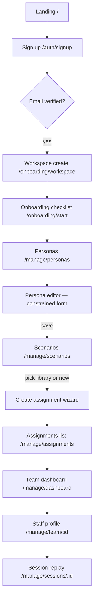
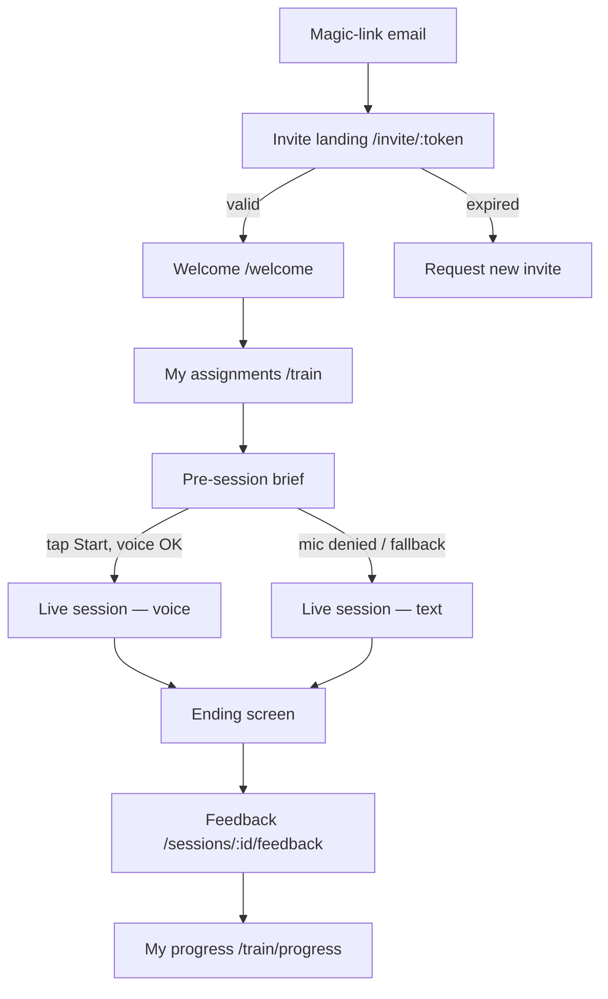

# Lobbyee — Information Architecture & Core User Flows

> Planning deliverable for design. Grounded in `docs/architecture.md`. Drives wireframes, not visual design.

---

## 1. Complete Screen Inventory

### (a) Marketing / Public

| Screen | Purpose | Key elements | States | Roles |
|---|---|---|---|---|
| **Landing (`/`)** | Convert hospitality GMs to trial signup. | Hero ("Train your team on the conversations that matter"), 30-sec demo video of a voice session + feedback, three-step "how it works," social proof, pricing teaser, primary CTA "Start free trial." | Default only. | Public |
| **Pricing (`/pricing`)** | Show plan + session cap. | Starter $79 (50 sessions/mo), comparison, FAQ on session caps, CTA. | Default. | Public |
| **Library scenarios preview (`/scenarios`)** | SEO + credibility. | Tiles for ~15 seeded library scenarios (title, difficulty, situation snippet), "Sign in to use" CTA. | Default; empty (during pre-launch) shows "Library coming soon." | Public |
| **Legal (`/privacy`, `/terms`, `/dpa`)** | Compliance. | Long-form. | Default. | Public |

### (b) Auth & Onboarding

| Screen | Purpose | Key elements | States | Roles |
|---|---|---|---|---|
| **Sign up (`/auth/signup`)** | Manager/owner account creation. | Email + password, Google SSO, magic-link option, ToS checkbox. | Default, submitting, error (email taken / invalid), success → redirects. | Public |
| **Sign in (`/auth/signin`)** | Returning users. | Email/password, Google, magic-link, "Forgot password." | Default, submitting, error (wrong creds, rate-limited). | Public |
| **MFA challenge (`/auth/mfa`)** | Owners with MFA on. | TOTP input, recovery code link. | Default, error (wrong code). | Owner/Manager |
| **Workspace create (`/onboarding/workspace`)** | First-run for new owner. | Workspace name, slug (auto + editable), industry (hotel / restaurant / training school), property size. | Default, submitting, slug-conflict error, success → redirect to dashboard. | Owner |
| **Onboarding checklist (`/onboarding/start`)** | Cold-start orientation. | 4 progress tiles: "Create a persona," "Pick a scenario from library," "Invite your team," "Run a sample session yourself." Skip + finish-later. | All-empty, partial, complete. | Owner/Manager |
| **Staff invite landing (`/invite/[token]`)** | Magic-link landing for invited staff. | "You've been invited to train with {Workspace}" + Accept button → seeds Supabase session, flips Membership to active. | Loading (token check), success, **invalid/expired token** (resend request), **already accepted** (link to sign in). | Staff (preauth) |
| **Staff first-run (`/welcome`)** | Set name + voice/mic permission primer. | Welcome card, "How this works" 3-bullet, mic permission explainer (no prompt yet), CTA "See my assignments." | Default. | Staff |

### (c) Manager / Admin

| Screen | Purpose | Key elements | States | Roles |
|---|---|---|---|---|
| **Team dashboard (`/[slug]/manage/dashboard`)** | The hero manager view: per-staff competency at a glance. | KPI row (sessions this period / cap, avg empathy/clarity/PS/professionalism, % staff active 7d), staff table (name, last session, 4 competency averages with sparkline, # sessions, status pill), date-range picker, "Top missed opportunities" panel (clustered phrases). | **Cold start** (no staff, no sessions: full-bleed empty state pointing at onboarding), **partial** (staff invited but no sessions), **loading skeleton**, **error** (Sentry-toast + retry), **filtered-empty**. | Owner/Manager |
| **Staff member profile (`/[slug]/manage/team/[userId]`)** | Drill into one staff member. | Header (name, role, joined, contact), 4 competency trend charts (last 30/60/90d), session history table (date, scenario, persona, modality, overall summary, scores), most-cited strengths + missed-opportunity quotes, "Assign scenario" CTA. | Cold (no sessions: "no data yet, assign a scenario"), loading, error. | Owner/Manager |
| **Team list (`/[slug]/manage/team`)** | Manage memberships. | Search, role filter, table (name, email, role, status: pending/active/removed, last session, invite-sent date), bulk invite button, per-row menu (resend invite, change role, remove). | Cold (no members → big "Invite your first teammate" CTA), pending-heavy, loading, error. | Owner/Manager |
| **Invite teammates modal/page** | Send magic-link invites. | Email rows (add row), role picker per row, optional message, "Send invites." | Default, validation (bad email), submitting, success (toast + return to team list), partial-failure list. | Owner/Manager |
| **Personas list (`/[slug]/manage/personas`)** | Browse/create reusable guest identities. | Grid of persona cards (avatar/initials, name, role tag, voice sample play button, baseline mood chip), "New persona" CTA, search/filter. | Cold (zero personas → "Start with a template" suggestions), loading, error. | Owner/Manager |
| **Persona editor (`/[slug]/manage/personas/new` and `/[id]/edit`)** | **Constrained form** (per architecture §12 risk 6 — not free system prompt). | Name, role (dropdown: business traveler, family, elite-tier loyalty, etc.), backstory (textarea, soft 500 chars), voice picker (Cartesia voice IDs with preview), baseline mood sliders (frustration, trust, patience, satisfaction 0–100), preview "How this guest will introduce themselves." | Default, dirty, submitting, save success (toast), validation error (per-field, inline), voice-preview loading/error. | Owner/Manager |
| **Scenarios list (`/[slug]/manage/scenarios`)** | Library + workspace-authored scenarios. | Two tabs: "Library" (workspaceId null) and "My workspace." Cards: title, difficulty 1–5, situation snippet, success-criteria count. "New scenario" CTA. | Cold (workspace tab empty → "Use one from library or create your own"), library-empty (pre-launch), loading. | Owner/Manager |
| **Scenario editor (`/[slug]/manage/scenarios/new` and `/[id]/edit`)** | Author a scenario. | Title, situation (textarea), difficulty 1–5, success criteria (structured: add criterion → label + description), library-toggle disabled for workspace authors. | Default, dirty, submitting, validation. | Owner/Manager |
| **Assignments list (`/[slug]/manage/assignments`)** | Who's assigned what. | Table: staff member, persona, scenario, due date, status (not started / in progress / completed / overdue), "Assign" CTA. Filters by staff, scenario, status. | Cold, loading, filtered-empty. | Owner/Manager |
| **Create assignment (`/[slug]/manage/assignments/new`)** | The "assign scenario to staff" action. | Step 1: pick scenario (library + workspace). Step 2: pick persona. Step 3: pick staff (multi-select with search). Step 4: optional due date + note. Review → Send. | Default, each step validation, submitting, success → return to assignments list with toast "Assigned to N staff." | Owner/Manager |
| **Session replay (`/[slug]/manage/sessions/[id]`)** | Read-only manager view of any session in workspace. | Same layout as staff post-session feedback (§3) but with manager affordances: "Mark for 1:1 review," "Copy quote to clipboard." Respects workspace setting "managers see evidence-only" vs "full transcript." | Loading, error, evaluation-pending state, evaluation-failed state. | Owner/Manager |

### (d) Staff / Trainee

| Screen | Purpose | Key elements | States | Roles |
|---|---|---|---|---|
| **My assignments (`/[slug]/train`)** | The staff home — what's on my plate. | Header (name + greeting), Hero card: next assigned scenario ("Start training" CTA), list below: other assignments (scenario title, persona name, difficulty dots, due-by, status pill). Optional "Practice" section (library scenarios on-demand). | **Cold (no assignments → "Nothing assigned yet — try a practice scenario")**, loading, error, all-completed celebration. | Staff |
| **Pre-session brief (`/[slug]/train/sessions/new?assignmentId=...`)** | Set expectations before the call. | Persona card (avatar, name, one-line backstory teaser — don't reveal hidden criteria), scenario situation paragraph, expected duration (~5 min), modality choice (Voice / Text), big "Start session" button (tap = audio unlock for iOS), mic-permission explainer. | Default, **mic-permission denied** explainer + Text fallback CTA, loading (issuing token), error (session cap hit, network), session-cap-reached state. | Staff |
| **Live session (voice) (`/[slug]/train/sessions/[id]`)** | **Hero screen — see §3.1.** | See §3.1. | Connecting, ready-to-speak, listening, guest-speaking, network-degraded, ended. | Staff |
| **Live session (text)** | Same route, text modality. | See §3.1 (text fallback). | Idle, user-typing, guest-thinking, guest-streaming, ended. | Staff |
| **Session ending screen** | Brief moment between hangup and feedback. | "Wrapping up your session…" + animated guest avatar fading. ETA copy: "Coaching takes about a minute." Link "Back to assignments — I'll notify you." | Loading, eval-still-pending (after 2 min: "Hang tight, this is taking a bit longer"), failed (rare, retry). | Staff |
| **Post-session feedback (`/[slug]/train/sessions/[id]/feedback`)** | **Hero screen — see §3.2.** | See §3.2. | Pending (eval queued), loading, ready, evaluation failed (apology + "Your transcript is saved — we'll retry"). | Staff (own) + Manager (any in workspace) |
| **Session history (`/[slug]/train/history`)** | All my past sessions. | List: date, scenario, persona, overall summary line, 4 mini-scores, modality icon. Filter by competency, scenario. | Cold ("Your first session will show up here"), loading. | Staff |
| **My progress (`/[slug]/train/progress`)** | Personal trends. | 4 competency line charts (30/60/90d), milestones ("First session with 5 in empathy"), "Most-cited strength" + "Recurring missed opportunity" cards — phrased as coaching, not punishment. | Cold (<3 sessions: "Two more sessions to unlock trends"), partial, full. | Staff (own) |

### (e) Shared / Account / Settings / Billing

| Screen | Purpose | Key elements | States | Roles |
|---|---|---|---|---|
| **Profile (`/account`)** | Edit own name, email, password, MFA setup, notification prefs. | Sections per concern. | Default, dirty, save errors. | All |
| **Workspace settings (`/[slug]/settings/general`)** | Name, slug, industry, transcript-visibility default (managers see evidence-only vs full), audio retention (30/90/365d). | Form. | Default, owner-only edits disabled for managers. | Owner; Managers read-only |
| **Billing (`/[slug]/settings/billing`)** | Plan + usage. | Current plan tile, sessions used / cap with progress bar, next reset date, "Manage in Stripe" portal link, invoices list. | Default, near-cap warning (>80%), cap-reached state with upgrade CTA, error fetching Stripe. | Owner |
| **Workspace switcher (global header)** | For trainers in multiple workspaces. | Dropdown of memberships with role badge. | One workspace (collapsed), multi (active list). | All multi-membership users |
| **Workspace deletion (`/[slug]/settings/danger`)** | 2-step owner-only delete (architecture §11). | Type slug to confirm, 30d soft-delete notice, audio purge note. | Default, confirming, scheduled-deletion banner once initiated, restore CTA before grace expires. | Owner only |
| **Notifications inbox (header bell)** | New assignment, eval ready, invite accepted. | Dropdown panel, mark all read, deep links. | Empty, unread, all-read, loading. | All |

---

## 2. The Two Core User Flows

### 2.1 Manager flow: signup → persona → assign → dashboard → drill in



**Numbered steps**

1. **Landing** → click "Start free trial."
2. **Sign up** form → enter email/password (or Google) → submit. (Decision: existing email → switch to sign in.)
3. **Workspace create** screen — name, slug, industry → "Create workspace."
4. **Onboarding checklist** — 4 tiles; pick "Create a persona."
5. **Personas list** (empty state) → click "New persona."
6. **Persona editor** — fill name, role dropdown, backstory, pick voice (with preview play), set baseline mood sliders → "Save persona." Toast confirms.
7. Onboarding checklist auto-advances → click "Pick a scenario." Lands on **Scenarios list → Library tab**.
8. Click a library scenario → "Use this scenario" → routes to **Create assignment** wizard prefilled.
9. **Assignment wizard:** step 2 pick persona (just-created shows pinned), step 3 multi-select staff (decision: no staff yet → side-quest to **Invite teammates** modal, send invites, return to wizard), step 4 due date + note, review → "Send assignments." Toast: "Assigned to N teammates."
10. **Onboarding checklist** marks step done → "Run a sample session yourself" prompts a self-assignment (skippable).
11. Click into **Team dashboard** — initial state shows cold-start illustration: "Your first session results will appear here." After staff complete sessions, KPIs and the per-staff table populate.
12. Manager clicks a staff row → **Staff member profile** — sees 4 trend charts, session history, recurring missed opportunities.
13. Click a row in session history → **Session replay** — reads inline-highlighted transcript and per-competency feedback, marks for 1:1.

Branches: (a) cap-reached at step 9 → upgrade CTA; (b) invite bounces → resend; (c) eval still pending in replay → "Coaching is still being prepared" state.

### 2.2 Staff flow: invite → session → feedback → progress



**Numbered steps**

1. Staff receives **invite email** with magic link.
2. Tap link on phone → **Invite landing** verifies token (loading) → "Accept invitation" → Supabase session created, Membership flips active. (Decision: token expired → "Ask your manager to resend." Already accepted → "Sign in.")
3. **Welcome** screen — sets name, primer on mic permission (no native prompt yet — that comes later, inside a tap gesture for iOS).
4. **My assignments** — sees hero card for next assigned scenario.
5. Tap hero card → **Pre-session brief** — sees persona avatar/name, situation paragraph, expected duration, voice/text toggle (defaults to voice). Sees mic explainer text.
6. Tap the big **"Tap to start"** button — this single user gesture (a) unlocks iOS audio, (b) triggers `getUserMedia` prompt, (c) fetches `/api/voice/session-token`, (d) connects WebRTC. (Decision: permission denied → inline switch to text modality with same scenario; permission granted → connecting state, then ready.)
7. **Live session (voice)** — guest greets first; staff listens, then mic indicator turns active. Staff speaks; sees their own transcription appear; guest replies (text crawls + audio plays). Mood indicator subtly evolves between turns. (Branch: tap text-fallback toggle → continue as text mid-session.)
8. Tap **"End session"** (confirm modal). → Session goes to `completed`; worker enqueues `PendingEvaluation`.
9. **Ending screen** — "Wrapping up your session… coaching takes about a minute." Option to back out — push notification will tell them when it's ready.
10. Polled or push-arrived → **Post-session feedback** — overall summary up top, then 4 competency cards each expandable to show inline-highlighted transcript with cited strengths and missed opportunities.
11. Tap **"See my progress"** → **My progress** — trends across all sessions.

Branches: (a) eval-failed → "Your transcript is saved; we'll retry. Your manager isn't notified." (b) network drop mid-session → reconnect banner; if lost > 30s → graceful abandon, partial transcript saved. (c) Session cap reached at step 6 → "Your workspace has hit its monthly limit; ask your manager to upgrade."

---

## 3. The Two Hero Screens — Deeper UX Treatment

### 3.1 Live training session (mobile-first)

**Layout regions (portrait phone, ~390×844):**

```
┌───────────────────────────────┐
│  ← Exit       Scenario title  │  ← thin header
│  Persona name · Difficulty •• │
├───────────────────────────────┤
│                               │
│                               │
│         GUEST AVATAR          │  ← ~45% of viewport
│      (circular, animated      │     animation pulses when guest
│       waveform when speaking) │     is speaking. Subtle.
│                               │
│      Guest: Maria, 34         │
│                               │
├───────────────────────────────┤
│  Mood pulse: ▮▮▯▯ (calm)      │  ← single-line mood strip
├───────────────────────────────┤
│                               │
│  Live caption / partial       │  ← turn area (auto-scroll)
│  transcript (1–2 lines)       │
│                               │
├───────────────────────────────┤
│         🎤  TAP TO TALK       │  ← primary affordance
│        (or hold — both work)  │
├───────────────────────────────┤
│  Aa Switch to text   ⏹ End    │  ← persistent secondary bar
└───────────────────────────────┘
```

**How the trainee sees the guest.** A large circular avatar (persona-generated illustration or initials in branded gradient) dominates the upper half. Persona name + role below. The avatar **breathes** subtly (slow scale animation) when the guest is idle, **pulses with the audio waveform** when the guest is speaking. This is the primary "who's talking" signal, paired with text — never color alone.

**How mood is surfaced (subtly).** A single horizontal strip just below the avatar — four small segmented bars labeled by *single icon* (a tightened heart, a brow, an hourglass, a smile-line). Bars fill in muted tones; a one-word label cycles based on dominant axis: *calm, tense, frustrated, warming, cooperative*. No numbers. **No sudden jumps** — animate transitions over ~600ms so it's perceived peripherally, not a scoreboard. A long-press on the strip reveals a tooltip explainer ("This shows how the guest is feeling — it shifts as the conversation evolves") — once-only, dismissable. Respects `prefers-reduced-motion`: fade only.

**Live coach line (always-on — decided 2026-06-11).** A slim strip labeled `COACH` sits between the caption area and the mic — one line, updated each turn ("She's still tense — acknowledge the frustration before explaining."). It is visually distinct from guest content (different background, prefix label, fixed slot) so the trainee never confuses the coach's voice with the guest's. Hints are ≤ 12 words, reference the current mood and the scenario's success criteria, and pause during reconnection. Design guardrails: peripheral styling (never animates to grab attention), and hi-fi should keep it quieter than the caption area — the conversation remains the primary surface. Hint display is logged per turn so the post-session feedback can later reference what the coach suggested vs. what the trainee did (v2).

**Voice affordances.**
- **Mic state:** the bottom round button has three visual states — *idle gray* (ready), *active red pulse* (capturing), *guest speaking* dimmed-and-disabled with a small "Guest is talking" label. Always paired with text, never color-only.
- **Who's speaking** is signaled by avatar animation + the mic button state + a subtle "Listening…" or "Guest replying…" line in the caption area.
- **Barge-in:** the trainee can tap the mic mid-guest-reply; this immediately stops TTS playback and starts capture. A small "Interrupted" chip flashes for 800ms so they know it registered (this matches real hospitality dynamics — guests interrupt).
- **iOS audio unlock:** the entry from the brief screen is **a single explicit "Tap to start" full-width button**, not autoplay. This is the load-bearing gesture per architecture §12 risk 3 — it kicks off audio context, mic permission, and worker connect together. Copy: "Tap to start — your guest will greet you first." We never reveal the audio context to the user, but we structure the UI so the first interaction *is* the unlock.

**Text-fallback toggle (always available).** A persistent "Aa Switch to text" button in the bottom-secondary bar. Tapping it (mid-session is allowed) collapses the avatar to ~25% height and reveals a chat-style transcript with an input + send button. Worker swaps pipeline; mood still updates. This is the **bypass for iOS bugs and bad wifi** and per architecture §5f ships day one.

**How a turn looks.**
- Trainee taps mic → button pulses red → live partial transcript appears in the caption area as they speak ("I understand the inconvenien—") → finalizes on silence end-of-utterance.
- Caption shifts to "Guest replying…" → guest avatar starts pulsing → captions for guest text stream in real time, synced to TTS.
- Mood strip animates after guest finishes speaking.
- A small "Turn 5 of ~25" chip top-right (low-prominence) so trainee knows they're not lost.

**How the session ends.**
- Trainee taps **⏹ End** → confirm sheet ("End this training session?" + "End" / "Keep going"). Avoids surveillance-feeling auto-cutoffs.
- 90-second silence triggers a gentle inline prompt ("Still there? — Yes / End session") not an immediate auto-end.
- On end → transition to **Session ending** screen.

**States.** Connecting (avatar dimmed, "Connecting to your guest…" + cancel), ready (avatar live, "Maria is waiting — tap to start"), guest-speaking, listening, network-degraded ("Connection is weak — switch to text?" button), worker-error ("We hit a snag — your transcript is saved, end session?"), ended.

**Accessibility.** Captions are not optional — they're the primary turn display, screen-reader friendly. All voice affordances duplicated as text. Touch targets ≥ 56pt for mic/end (above 44pt floor — these are critical). Mood changes announced to screen reader on demand only (`aria-live="polite"` muted by default; opt-in toggle in settings) to avoid noise.

### 3.2 Post-session feedback

**Layout regions (mobile vertical; desktop = same content, two columns):**

```
┌──────────────────────────────────────┐
│  ← Back        Session — Aug 12       │
├──────────────────────────────────────┤
│  Scenario: Late check-in complaint    │
│  Persona: Maria · Voice · 5m 42s      │
│                                      │
│  ╔═══════════════════════════════╗   │
│  ║  Overall                       ║   │
│  ║  "You stayed calm and offered  ║   │
│  ║   a real fix — next time, ask  ║   │
│  ║   one more clarifying question ║   │
│  ║   before jumping to a solution"║   │
│  ╚═══════════════════════════════╝   │
├──────────────────────────────────────┤
│  Empathy           ●●●●○  4 / 5      │
│  Clarity           ●●●○○  3 / 5      │
│  Problem solving   ●●●●●  5 / 5      │
│  Professionalism   ●●●●○  4 / 5      │
│  (tap a row to expand)                │
├──────────────────────────────────────┤
│  ▼ Empathy — 4/5                      │
│     Summary: short paragraph          │
│     ✓ Strength (2)                    │
│       "I can hear how frustrating     │
│        that must have been."          │
│       Why it worked: …  · Jump to ↗   │
│     ⚠ Could go further (1)            │
│       "Let me transfer you."          │
│       What to try: acknowledge…       │
│       · Jump to ↗                     │
├──────────────────────────────────────┤
│  Transcript (highlighted)             │
│   ... long scrollable transcript      │
│   with inline yellow/green markers    │
│   at cited messageIds                 │
├──────────────────────────────────────┤
│  Replay session (audio if available)  │
└──────────────────────────────────────┘
```

**Presentation strategy.** The screen leads with the **overall summary** in plain language — explicitly framed as coaching, not as a grade. Below it, the four competency rows with 1–5 scores rendered as **filled dots** (not a percentage, not a letter grade — both feel like report cards). Each row is collapsed by default; tapping expands to summary + strengths + missed opportunities.

**Two evidence types, two visual cues (color + icon + label — never color alone).**
- **Strengths** → green check icon + "Strength" label.
- **Missed opportunities** → amber dotted-circle icon + "Could go further" label (deliberately not "Mistake," "Weakness," or "Failed"). Copy framing comes from coaching, not assessment.

**Linking quote → transcript moment.** Each evidence card shows the verbatim quote (from `EvaluationEvidence.quote`) in italics with a "Jump to" link. Tap → smooth-scrolls the transcript section into view and animates a highlight on the cited message for ~1.5s. Inline in the transcript, every cited message has a left-edge marker (green bar for strength, amber dotted bar for missed) and quoted spans get subtle background tint. Multiple citations on the same message stack their markers.

**Transcript display.** Chat-style, persona avatar left for guest turns, "You" label for staff turns. Each turn has a timestamp (relative: 0:34) and a tiny mood chip on guest turns visible on long-press (peripheral, not loud). Audio replay (when bundle exists) lets you tap a turn to scrub the audio to that timestamp — `audioBundleUrl` 5-min signed URL fetched on demand.

**"Coaching not judgment" microcopy choices.**
- Headline of overall card: "Coaching from your session" — not "Your score."
- For 1–2 scores: "Lots of room to grow here — see what to try next." Never "You failed."
- Missed-opportunity cards always end with **what to try next time**, not just what went wrong.
- No comparisons to other staff. No leaderboards.
- Manager-only views show the same content; framing copy switches to neutral ("Strengths cited" / "Opportunities cited") because managers are reviewing, not learning.

**States.** Pending ("Your coaching is being prepared — usually about a minute" with skeleton of the score rows), partial (3 of 4 done — show the ready ones, "Professionalism still loading"), ready, eval-failed-after-retries (an honest message: "We couldn't generate detailed coaching for this one — your transcript is here for reference. We've been notified." + transcript still viewable), no-evidence-for-competency (score shown, evidence section says "No specific moments flagged — see summary" rather than empty).

**Accessibility.** Scores announced as "Empathy: 4 of 5." Inline transcript markers have `aria-label="Cited as a strength"`. Jump-to-transcript respects `prefers-reduced-motion`. Color contrast for green/amber meets 4.5:1 against background. Expand/collapse is keyboard-operable.

---

## 4. Mobile-First vs Desktop Considerations

| Surface | Primary | Notes |
|---|---|---|
| **Staff: assignments, brief, live session, feedback, progress, history** | **Phone (primary)** | Designed at 390-wide; the live session is portrait-only (lock orientation). Tablet/desktop should work but are not the design target. |
| **Manager: dashboard, staff profile, scenario/persona editors, assignments wizard, replay** | **Desktop (primary)** | Dashboards need horizontal real estate for trend charts + per-staff tables. Wizard step layouts work on tablet. Phone fallback for dashboard = stacked KPI cards + scrollable staff list (no charts > 320w). |
| **Onboarding checklist, settings, billing, invite landing, auth** | **Both equally** | Mobile and desktop both used; design responsive cards. Invite landing **must** be polished on phone (staff click email on phone). |
| **Marketing** | **Both** | Desktop conversion + mobile demo video. |

**Breakpoints.** Tailwind defaults: `sm` 640 (manager dashboard becomes scrollable cards → card grid), `md` 768 (wizard step layouts switch to two-column), `lg` 1024 (manager dashboard reveals trend charts + side panel for top-missed), `xl` 1280 (staff profile becomes 3-column: header, chart, history). Live session is **never** repositioned for desktop beyond max-width centering — keep the mobile metaphor.

**Touch targets.** Mic button 56pt, end-session 56pt, jump-to-transcript chips 44pt. Manager dashboard rows 48pt min row height on touch surfaces.

---

## 5. Prioritization — Which Screens to Wireframe First

Wireframe in this order. Each unlocks the next. The intent is to prove the **core demo loop**: a manager assigns, a staff member trains, the feedback is the wow.

1. **Live training session (voice — staff)** — The product. If we can't draw this convincingly, nothing else matters. Wireframe the layout, mic affordance, mood strip, text toggle, ending. Depends on nothing.
2. **Post-session feedback (staff/shared)** — The differentiator. Defines how transcript-grounded evidence is presented inline. Design as a pair with #1 (shared transcript metaphor).
3. **Pre-session brief (staff)** — The setup for #1; carries the iOS audio-unlock gesture. Sets persona/scenario expectations.
4. **My assignments (staff home)** — Entry point to #3. Sets cold-start tone for staff.
5. **Team dashboard (manager)** — Closes the demo loop ("manager sees staff progress"). Sets the manager visual language. Depends on #2 (summarizes the same evidence/scores).
6. **Persona editor (constrained form, manager)** — The constrained-form is a design decision worth pinning down early before scope-creep slips in a free system-prompt field. Defines the manager-CRUD pattern reused for scenario editor and assignment wizard.

**Defer to second pass:** scenario editor, assignment wizard, staff profile drill-in, billing, settings, auth, marketing, onboarding checklist, invite landing. These are pattern-reuse from the six above.

**Dependencies note.** #1 ↔ #2 share the transcript metaphor — design as a pair. #5 reuses #2's evidence rendering at aggregate level. #6 sets manager form conventions reused in scenario editor.

---

## 6. Top UX Risks

1. **Mood indicator becomes a scoreboard the trainee fixates on, breaking immersion.** → Single peripheral strip, no numbers, slow animation (~600ms), word labels not metrics, long-press to learn what it means.
2. **Feedback feels like surveillance or a graded test — staff disengage or game it.** → Coaching microcopy ("Could go further" not "Failed"), every missed-opportunity card ends with "what to try next time," no leaderboards, no peer comparison, framing card at top says "Coaching from your session."
3. **iOS mic permission friction at session start kills completion.** → The "Tap to start" button **is** the unlock gesture (single tap = audio context + permission + WebRTC connect). Mic-denied path immediately offers Text as same-scenario continuation, not a dead end. PostHog watches voice→text drop rate.
4. **Manager dashboard cold-start (no staff, no sessions) feels broken — looks like a half-built product.** → Full-bleed empty state with illustration + 3-step checklist + a "Run a sample session" path so the owner can hit the dashboard with their own data within 5 minutes of signup.
5. **Persona builder scope creep — managers paste in jailbreak-prone prompts.** → Constrained form only (dropdowns + sliders + bounded textareas); no "system prompt" field exposed. Live preview ("How this guest will introduce themselves") reduces the pull toward freeform control.
6. **Evidence-pending state on feedback screen makes staff feel they failed silently.** → Honest pending state ("Coaching is being prepared — usually about a minute"), notification when ready, retry-failed state owns the failure and surfaces the transcript so the session was never wasted.
7. **Staff training on a moving subway loses connection mid-session — feels like punishment.** → Persistent text-fallback toggle, reconnect banner with clear copy, graceful abandon preserves partial transcript, resume link in notification. Cap-reached and worker-failure states never blame the user.
8. **Mood/score animations and audio cues exclude users with motion or hearing sensitivity.** → All animations respect `prefers-reduced-motion`. Captions are the primary turn display, not a secondary affordance. Mood changes are silent and screen-reader-quiet by default.
